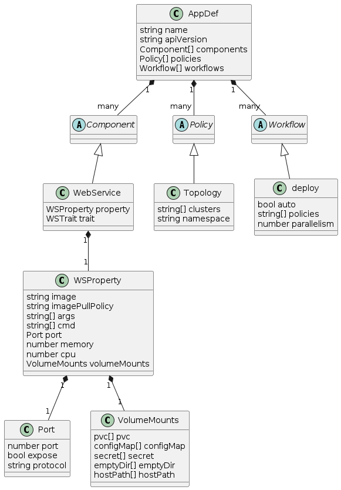

# OAM

## 摩洛哥编辑器


## Quick Start

**安装依赖**

```sh
pnpm install
```

**langium:generate**
```sh
pnpm run langium:generate
```

**build**

按照依赖关系 build，在下面的目录下依次运行

- aom-core
- aom-cli
- aom
- monaco-aom

```sh
pnpm run dev
```

**aom.sh**

demo 在 docs/demos 目录下

aom.sh 有几个命令，

- `./aom.sh compile xxx.aom`，可以实现编译
- `./aom.sh up -f xxx.yaml` （没有ir的），可以实现部署
- `./aom.sh delete xxx.yaml`（没有ir的），可以实现删除

**monaco-aom**

在 monaco-aom 目录下

```sh
pnpm run build:web
pnpm run serve
```

## 概念模型



- AppDef：一个应用部署计划的定义
- Component：组件定义一个应用包含的待交付制品（二进制、Docker 镜像、Helm Chart...）或云服务。我们认为一个应用部署计划部署的是一个微服务单元，里面主要包含一个核心的用于频繁迭代的服务，以及一组服务所依赖的中间件集合（包含数据库、缓存、云服务等），一个应用中包含的组件数量应该控制在约 15 个以内。
  - Webservice：描述长期运行、可扩展的容器化服务，这些服务拥有稳定的网络端点，可接收来自客户的外部网络流量。
    - image：镜像
    - imagePullPolicy："Always" or "Never" or "IfNotPresent"	
    - args：进入镜像的参数
    - cmd：镜像中运行的命令
    - env：环境变量
    - cpu：cpu资源数量
    - memory：存储大小
    - volumeMounts：持久化情况
- Policy：应用策略负责定义指定应用交付过程中的策略，比如多集群部署的差异化配置、资源放置策略、安全组策略、防火墙规则、SLO 目标等。
  - Topology：描述组件应部署到的目的地。
    - clusters：指定要选择的集群名称，例如 `local`
    - namespace：指定要部署到所选集群中的目标命名空间，默认继承原始命名空间。
- Workflow：工作流由多个步骤组成，允许用户自定义应用在某个环境的交付过程。典型的工作流步骤包括人工审核、数据传递、多集群发布、通知等。
  - Deploy：功能强大的统一部署步骤，可利用策略实现组件的多集群交付。
    - policies：声明本次部署使用的策略。
    - parallelism：同时交付组件的最大数量。
    
## Simple Intro

## dev 

### @aom/cli

**用途**

- 提供命令行工具
- 组合 `@aom/core` 提供的语言服务，实现功能

**运行环境**

- NodeJs

### vscode-aom

**用途**

- 组合 `@aom/core` 提供的语言服务，实现 Language Server
- 提供 VSCode 插件

### monaco-aom

**用途**

- 组合 `@aom/core` 提供的语言服务，实现 Language Server
- 提供 monaco 插件


模块化： 资源作为模块资源独立定义，把资源引入到应用

软件分成若干块，不同层次划分

